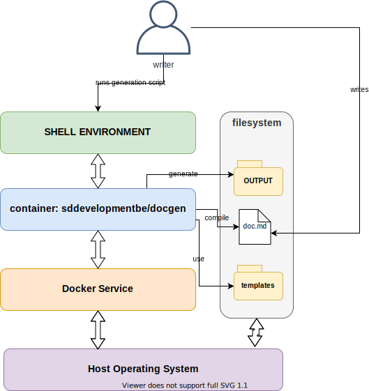

# DocGen Project User Guide

**Table of Contents:**
<!-- vim-markdown-toc GFM -->

* [Background Information](#background-information)
* [Project Structure](#project-structure)
* [System Requirements](#system-requirements)
* [Getting Started with SDD DocGen](#getting-started-with-sdd-docgen)
  * [Start the containers](#start-the-containers)
  * [Run conversion](#run-conversion)
* [Specific Tasks and Goals](#specific-tasks-and-goals)

<!-- vim-markdown-toc -->

## Background Information

The DocGen project is meant as a way to simplify the installation and usage of 
FOSS plain text document layouting systems. The main advantages of using a plain 
text format to write and maintain your documentation files are:
* **Avoiding cross-vendor incompatibilities:** converting documents from one format 
to another is a tedious task. This is even more the case when the file format of your 
documentation is a proprietary format.
* **Versionable documentation:** plain text files allow you to make use of most 
[CVS systems](https://en.wikipedia.org/wiki/Concurrent_Versions_System). This allows you to choose whatever CVS suits you best, and allows you 
to use your favorite versioning tooling. 
* **No special tooling needed:** while writing plain-text document syntax is significantly 
simplified by using a text-editor with syntax support for layouting languages, they are not 
required. A simple editor such as `nano`, `vi` or `notepad` is sufficient.


## Project Structure
Most of the DocGen Project is a simple aggregation of various Free and Open Source Software 
projects. The main issue when relying on an eclectic stack to generate documents is that you 
need to install and configure all components on every machine you wish to use it.

DocGen aims to solve this by providing users with an easier way to do this set-up.
Installation and usage of this repository (stand-alone or as a supporting stack for your 
other repositories) should be limited to three distinct installation operations:

* Install the container framework (Docker)
* Clone the repository 
* Run the conversion scripts

The diagram below shows how the DocGen stack operates on your personal machine or server infrastructure. 



## System Requirements

* Docker version 19+
* Sufficient RAM (4 GB and higher)
* Sufficient free memory space ( recommended 10 GB or more for docker images )

## Getting Started with SDD DocGen

Before attempting to use the project for yourself,
try to build the samples included in this repository first.
This will give you a good idea of how the project is intended to be used,
and how you can extend or adapt it to your own needs.

### Start the containers

Create the docker image.
```bash
cd ./ops
sh build_docker.sh <VERSION>
```
### Run conversion

Start the docker-compose containers and execute the commands showed below.
You can edit the scripts in [ops/scripts/](../ops/scripts/), or add your own.

```bash
docker-compose -f ./ops/docker-compose.yml up -d --remove-orphans
docker-compose -f ./ops/docker-compose.yml exec linux sh /root/docGen/scripts/doc_runner.sh documents/document_sample.md document sdd-base
```

Alternativly, you can use the `convert_documents.sh` script included in this repository's root
to run all the examples. The result of these can be found in your local **./output** directory.

## Specific Tasks and Goals

> INFO: This section is a STUB and will be expanded in the future
* [Documenting in markdown](./guides/documenting_in_markdown.md)
* [Creating slideshows with DocGen](./guides/slideshows_with_markdown.md)
